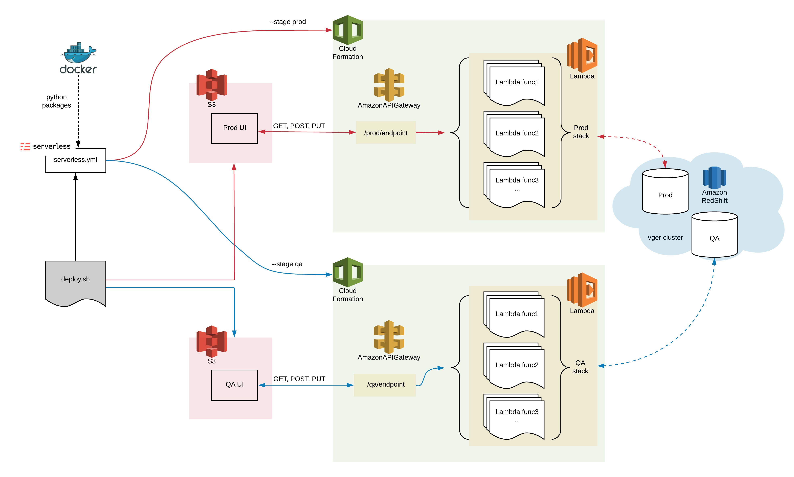
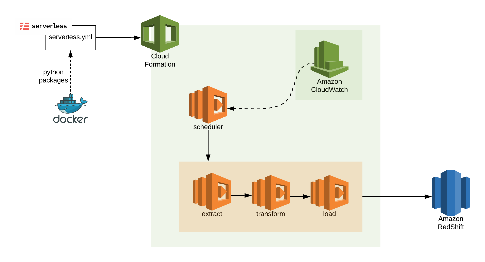
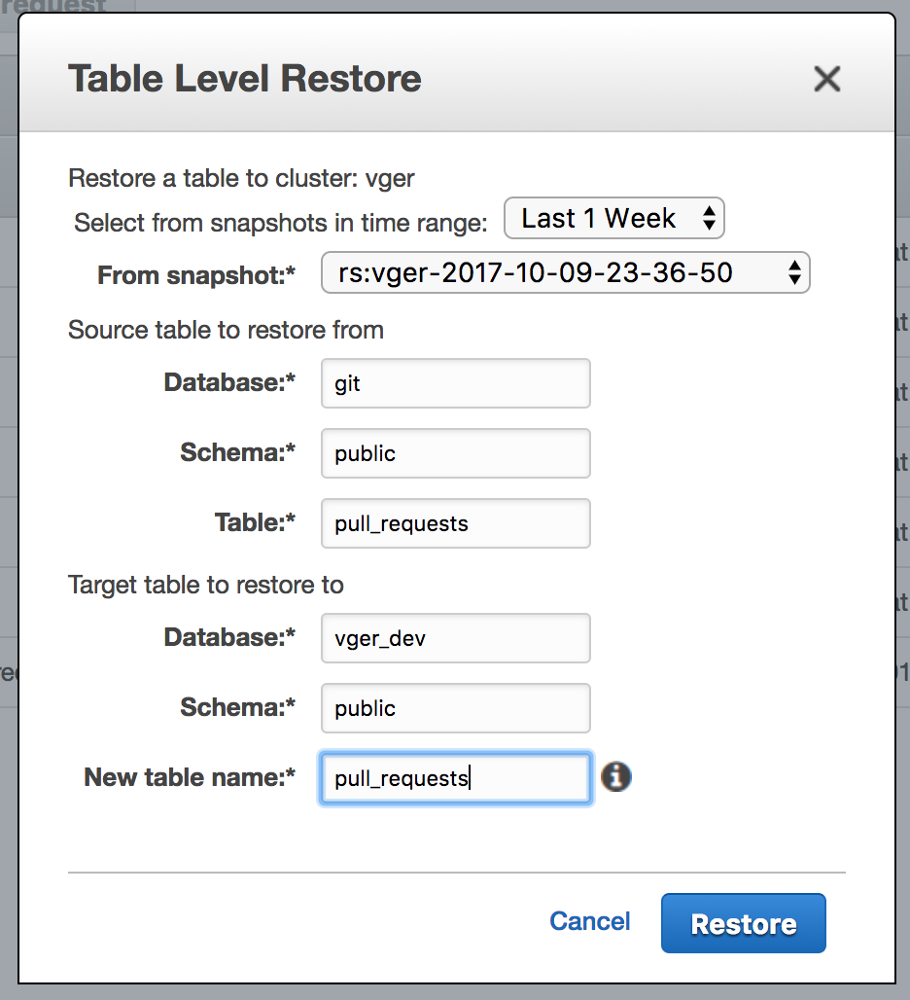
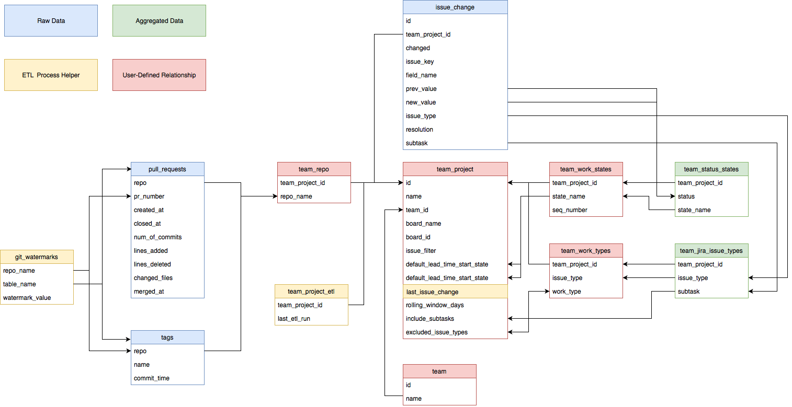

# Hitchhiker's Guide to Vger

* [Quick Links](#quick-links)
* [Getting Started](#introduction)
* [Overview](#overview)
* [Deployment](#deployment)
  * [UI Deploy](#ui-deploy)
  * [Backend Deploy](#backend-deploy)
* [Frontend Development](#frontend)
* [Backend Development](#backend)
  * [Backend components](#backend-components)
    * [Lambda](#lambda)
    * [API Gateway](#apig)
    * [CloudFormation](#cloudformation)
    * [Redshift](#redshift)
  * [Unit Test](#backend-unit-test)
  * [Integration Test](#backend-integration-test)
* [System Management Task](#system-management)  
  * [CloudWatch logs](#cloudwatch)  
  * [How to restore data from snapshots](#restore-data-from-snapshots)  
  * [How to detect locks on table](#detect-locks-on-table)  
  * [How to remove obsolete data](#remove-data)  
  * [Understanding the database design](#database-design)
* [More about Vger](#more-about-vger)


<a name="quick-links"/>

# Quick Links
**See developer-guide.md for comments**
<!-- * [Vger QA UI](qa url) -->
<!-- * [Vger Prod UI](prod url) -->
<!-- * [S3 QA](s3 qa bucket) -->
<!-- * [S3 Prod](s3 prod bucket) -->
<!-- * [API gateway QA](qa api gateway link through aws) -->
<!-- * [API gateway Prod](prod api gateway link through aws) -->
<!-- * [CloudFormation QA UI](cloudformation qa url) -->
<!-- * [CloudFormation Prod UI](cloudformation prod url) -->
<!-- * [CloudFormation Prod git ETL](cloudformation for git ETL) -->
<!-- * [CloudFormation Prod jira ETL](cloudformation for jira ETL) -->
<!-- * [CloudWatch git ETL](cloudwatch for git ETL) -->
<!-- * [CloudWatch jira ETL](cloudwatch for jira ETL) -->
<!-- * [Redshift](redshift url) -->
<!-- * [Lambda](lambda url) -->

<a name="introduction"/>

# Getting Started
**See developer-guide.md for comments**

### As a Vger Developer

1. Check AWS Console. Make sure you have the access to the following services:
    - Lambda
    - CloudWatch
    - CloudFormation
    - S3
    - Redshift
    - APIGateway
2. Get yourself an IDE. Recommend [PyCharm](https://www.jetbrains.com/pycharm/)

#### Deployment Preparation

1. Make sure you have installed `Node.js` and install `serverless` via `npm`.
2. Install [Docker]((https://docs.docker.com/docker-for-mac/install/#install-and-run-docker-for-mac)).

#### Local Development Preparation

1. For `Node.js`, you need to `npm install http-server -g` in order to run UI locally.
2. Install `Python2.7` and here are some of the pip packages that we used in Vger(No need to install, but if you want to test something locally you need them):
    - General: `psycopg2, requests`
    - Time calculation related: `pytz, iso8601, intervaltree`
    - AWS SDK `boto3`
    - Scientific calculation: `pandas` for JIRA ETL and `numpy` for throughput predictability 
    - JIRA Library `jira`
    - Miscellaneous: `pyYAML, filechunkio` for JIRA ETL
    
    Make sure all these packages are installed to the `Python2.7` you used for the project with `pip2.7`(or other `pip` based on your configuration)
3. To test locally with proper environment parameter, you can get all the parameters using the `deploy/env-config.sh` command. Use this command to print Vger environment configuration for either the `qa` or `prod` deployment environment:

    ```
    # Prints environment configuration for the QA environment
    cd bv-vger
    deploy/env-config.sh -p qa
    ```

    You need to put the environment variables in `.bash_profile` with the following format:

    ```
    export AWS_RS_USER='masteruser'
    ...
    ...
    ```


#### How to connect to the database

To connect to the data, following values are needed in the bash_profile:

* **AWS_RS_PASS**: The database user password
* **AWS_RS_USER**: The database user name
* **CLUSTER_ENDPOINT**: The database host
* **DATABASE_NAME**: The database name
* **REDSHIFT_PORT**: The database port

**Option 1.** Using the `psql` command  
```
$ brew install postgres
$ psql -h ${CLUSTER_ENDPOINT} -p ${REDSHIFT_PORT} -U ${AWS_RS_USER} -d ${DATABASE_NAME}
```
**Option 2.** Using the SQL Workbench UI  
1. Confirm that Java Runtime Environment (JRE) is installed
2. Install [SQL WorkBench](http://www.sql-workbench.net/downloads.html) and [JDBC driver](http://docs.aws.amazon.com/redshift/latest/mgmt/configure-jdbc-connection.html#download-jdbc-driver)
3. Setup connection profile in SQL WorkBench
    - Click on `Manage Drivers`
    - Select `Amazon Redshift JDBC Driver`
    - Locate the driver from your local machine
    - Click Ok 
    - Enter URL: `jdbc:redshift://${CLUSTER_ENDPOINT}:${REDSHIFT_PORT}/${DATABASE_NAME}` 
    - Enter Username: `${AWS_RS_USER}`
    - Enter Password: `${AWS_RS_PASS}`
    - Notice the `Autocommit` toggle button. Any DML and some DDL statements won't take effect until you commit your statements. 

<a name="overview"/>

# Overview

##### UI


##### ETL


<a name="deployment"/>

# Deployment

<a name="ui-deploy"/>

### Deploy Frontend

`bv-vger/deploy/deploy.sh` to deploy changes in `source/web_api` and `source/webpage` and to QA or Prod. The first argument identifies the deployment environment -- either `qa` or `prod`.  For example:

    cd bv-vger
    ./deploy/deploy.sh qa   # deploy to QA

**See developer-guide.md for comments**
<!-- there should be links to the URL of the apps generated by the S3 bucket -->
Once the UI is deployed, you can check your results at the URL for [QA]() or [production]().

To deploy `source/webpage` only(no Lambda changes): ` ./deploy/deploy-ui.sh qa`

If you don't see any UI changes after deployment, perform a full refresh in the browser (Chrome: [Cmd + Shift + r]).

<a name="backend-deploy"/>

### Deploy Backend

Severless Framework uses `serverless.yml` to create, update and tear down all resources involving the app. Refer to the full template from [here](https://serverless.com/framework/docs/providers/aws/guide/serverless.yml/). Keep in mind that the [serverless-package-python-functions](https://github.com/ubaniabalogun/serverless-package-python-functions/blob/master/README.md) plugin overrides `include` and `exclude` syntax for packaging libraries.

To deploy lambda functions to a specific deployment environment -- either `qa` or `prod` -- use the `deploy/deploy-lambda.sh` command. This command invoke Serverless to
deploy the code for all lambda functions defined by the `serverless.yml` file in a specific source folder. For example:

```
# Deploy the Jira ETL serverless configuration to the QA environment
cd bv-vger
deploy/deploy-lambda qa source/jira_etl
```

<a name="frontend"/>

# Frontend Development

### How to run UI locally

To see the UI running locally at [localhost:8080](http://localhost:8080), run the following commands.

    # Run current UI code from local http-server
    cd bv-vger
    ./ui-local.sh  # Browses to main page at localhost:8080


Warning: Buttons that navigate to other pages within the app won't work when running locally! Vger URL paths are expected to begin with `/vger`, which identifies the S3 folder containing UI code. But S3 isn't used when running UI code locally. To work around this difference, remove the leading `/vger` from the URL in the browser.
For example, change this:

```
http://localhost:8080/vger/#!/team
```

to this:

```
http://localhost:8080/#!/team
```

__REMINDER__: The local UI is sharing Lambdas in QA environment together.

**See developer-guide.md for comments**
<!-- webpage readme.md link here -->
For stacks used in frontend, check [here]().


<a name="backend"/>

# Backend Development 

<a name="backend-components"/>

### Backend components

<a name="lambda"/>

##### Lambda
Amazon Lambda is a serverless computing platform that runs code in response to events, and spontaneously manages the resources required to finish the task. Some examples of these event triggers are:
- S3 object creation
- CloudWatch scheduled events
- Custom REST API and gateway endpoints

These events gets read in as JSON function arguments, and the function definition handles the event data, then finally return a payload to the original caller.

For Lambdas in Vger, check [here](./lambdas.md).

<a name="apig"/>

##### API Gateway
**See developer-guide.md for comments**
<!-- the URL's for the api gateway homes -->
The Amazon API Gateway provides an API endpoints that can be accessed by the UI and trigger events such as invoking a lambda function. Each API has sets of resources and methods. Resources are the logical entity that an app can access through a resource path. For example, `/team` is the path of the resource representing the registered teams in Vger, and `GET /team` method queries the list of teams. Vger has 2 APIs. One for [QA]() and one for [Prod]().

To configure API Gateway, you can either do it manually in AWS console or check serverless.yml for setting up "RequestResponse" type of API Gateway. For more complicated API Gateway setup, check [here](https://docs.aws.amazon.com/apigateway/latest/developerguide/integrating-api-with-aws-services-lambda.html). 

<a name="cloudformation"/>

##### CloudFormation
CloudFormation groups multiple AWS resources into a single stack. An important advantage of using CloudFormation is that it allows developers to automate deployment in simpler steps. Vger utilizes [Serverless Framework](https://serverless.com/) and CloudFormation to create and link lambda functions with API gateway.

<a name="redshift"/>

##### Redshift
Amazon Redshift is a cloud data warehouse based on PostgreSQL 8.0.2. All Vger data is located under the data cluster named vger. Currently the cluster holds two databases: `git` and `vger_dev`. The `git` database is our production database, which needs to be renamed to something more relevant like `vger_prod` in the future, and `vger_dev` is our development database used as a testing ground.

Compared to PostgresSQL, Redshift __does not__ have any key restriction(no primary key) and __does not__ support `UPSERT`.

<a name="backend-unit-test"/>

### How to run lambda unit tests 
[TODO] make unit tests!

<a name="backend-integration-test"/>

### How to run lambda integration test

A. Use serverless command to invoke locally using:
```
serverless invoke local --function lambda_function --data '{"data": "some data"}'
```
Or to pass data as file:
```
serverless invoke local --function lambda_function --path data.json
```

<a name='system-management'/>

# System Management Task

<a name="cloudwatch"/>

### CloudWatch logs
Amazon CloudWatch is your go to place when debugging lambda functions. It is a log book of all events that ever happened and is very useful when tracing down errors. So it is useful place to check after updating a lambda function to make sure there were no import errors. You can directly search for an individual lambda logs from the CloudWatch web dashboard -> Logs -> search /aws/lambda/vger-sls-{function-name}.

<a name="restore-data-from-snapshots"/>

### How to restore data from snapshots
By default, the vger cluster creates daily automated snapshots with one day retention period. You can use restore action to recover lost data, or to import data between the prod and test database by table level.

<p align="center"></p>

The screenshot above shows an example of importing step of the `pull_requests` table from `git` to `vger_dev` database using the management console. Same can be done through the AWS cli. 

```shell
# list available snapshots
aws redshift describe-cluster-snapshots --cluster-identifier vger

# restore table
aws redshift restore-table-from-cluster-snapshot \
--cluster-identifier vger \
--source-database-name git \
--source-table-name pull_requests \
--target-database-name vger_dev \
--new-table-name pull_requests \
--snapshot-identifier rs:vger-2017-10-09-23-36-50 

# monitor restore progress
aws redshift describe-table-restore-status --cluster-identifier vger \
--table-restore-request-id $ID
```

<a name="detect-locks-on-table"/>

### How to detect locks on table
Sometimes you may notice a query hanging for a very long time on certain tables from SQL workbench. In such cases, check `STV_LOCKS` table to see currently locked tables, and `STV_SESSIONS` table to monitor active user sessions. You can also run `SELECT pg_terminate_backend(pid)` to kill any hanging process if it seems safe to do so. If nothing else works, reboot the cluster with `aws redshift reboot-cluster --cluster-identifier vger`.

Another way to detect lock on certain table in Redshift besides `STV_LOCKS` is the following SQL:
```SQL
select 
  current_time, 
  c.relname, 
  l.database, 
  l.transaction, 
  l.pid, 
  a.usename, 
  l.mode, 
  l.granted
from pg_locks l 
join pg_catalog.pg_class c ON c.oid = l.relation
join pg_catalog.pg_stat_activity a ON a.procpid = l.pid
where l.pid <> pg_backend_pid();
```
Then `SELECT pg_terminate_backend(pid)`.

<a name="remove-data"/>

### How to remove obsolete data

Teams occasionally create new projects to replace old projects that have changed or become unused. Unfortunately, that leaves all the data for the old project in place.
And the Vger UI doesn't offer a way to remove it.

But to prevent an obsolete project from cluttering the UI and wasting data resources, you can delete it directly from the database using the `delete-project.sh` command.

```
# Delete an obsolete team project from the production environment.
# This also deletes data for any GitHub repo used only by the deleted project.
cd bv-vger
db/delete-project.sh prod
------------------------------------------------------------
Team name: <Enter team name>
Project name: <Enter name of project to delete>
Deleting project=<Project name>...
Deleting repo=<Repo name>...
```

If necessary, you can also delete obsolete GitHub repo data using the `delete-repo.sh` command.

```
# Delete data for one or more obsolete repos from the QA environment.
# Repo data is deleted ONLY for a repo that is no longer referenced by any team project.
cd bv-vger
db/delete-repo.sh qa repo1 repo2 ...
------------------------------------------------------------
Deleting repo=repo1...
Can't delete repo=repo2 -- still used by these projects: foo,bar,baz
```


<a name="database-design"/>

### Understanding the database design
Below is an ER diagram of the current Vger database schema.

<p align="center"></p>

<a name="more-about-vger"/>

# More about Vger

Still confused? Check this [FAQ](./faq.md).

Don't know what to do next? You can find some inspirations [here](./vger_future.md).
