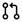
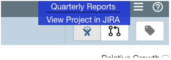
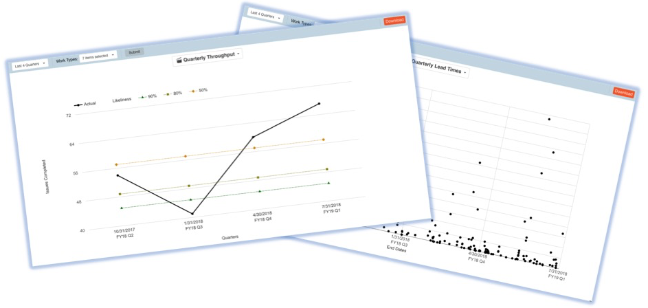
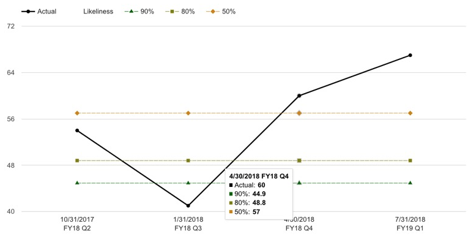
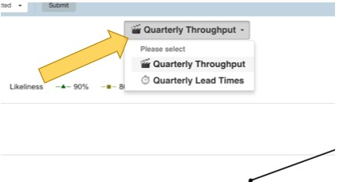
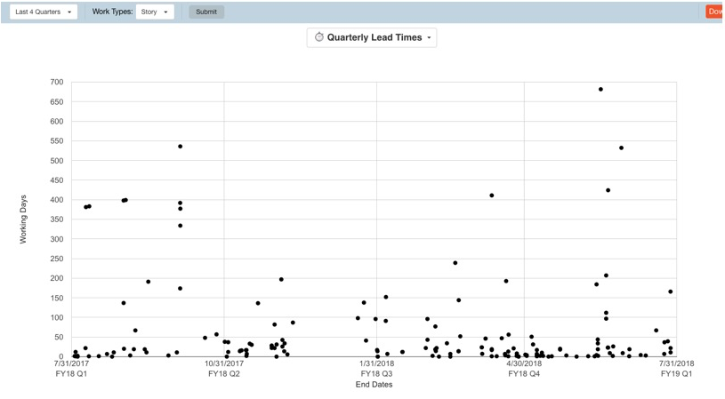
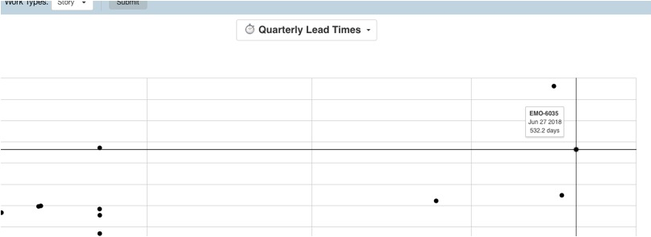
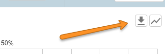
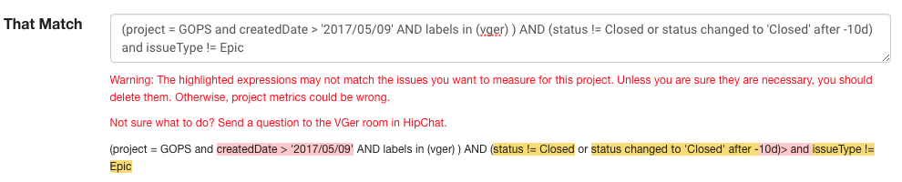

Quality Assurance : Vger: The Complete Guide
============================================

What is Vger?
-------------

Vger is an internal Web app developed by the bazaarvoice QA team to give BV teams insight into their performance. It gathers data from GitHub and JIRA to answer questions such as:

*   How has performance changed over time?
*   How has performance changed between releases?
*   Does performance vary for different work types? For different work states?

Vger is based on the concept of a [balanced metrics dashboard](http://focusedobjective.com/team-metrics-right/)
 that allows you to look at team performance from several different perspectives.

How does it work?
-----------------

*   Create a "team project" that defines how the work items for your team are organized in JIRA and GitHub. 

*   Use the controls at the top of the page to select the time period you want to examine.

*   Click on  to see information about your performance on JIRA issues.

*   Click on  to see information about your performance on GitHub pull requests.

*   Click on  to learn more about each chart.

How do I create a team project?
-------------------------------

Before you can create a team project, you must define the team it belongs to. If this is your first team project, click **`Vger`** in the top navigation bar, then click **`Add Team...`**. You will then be prompted to enter the basic info for your first team project.

To add a project to an existing team, click **`Vger`** in the top navigation bar, then select the team name, then click on the **`Add Project...`** button.

To create a team project, enter the following basic info. Afterward, the `**Edit Project**` dialog will prompt you to complete your project configuration.

How do I configure my team project?
-----------------------------------

When you create a new team project, the **`Edit Project`** dialog shows you the default project configuration.

The defaults here are derived from your JIRA board configuration. But you should review them carefully and make any changes needed. In particular, you may see the following warning. **Do not ignore it!**

> Warning: The highlighted expressions may not match the issues you want to measure for this project.

You can change your project configuration at any time.

To customize how Vger organizes metrics by JIRA issue types, you can edit work types.

To customize how Vger organizes metrics by JIRA issue status, you can edit work states.

### Edit Work Types

To present the `**Edit Work Types**` dialog, click on  next to the Work Types list in the top navigation bar.

This dialog shows how Vger organizes metrics by "work type". By default, Vger creates a work type for each JIRA issue type used in your project. But you can customize this by grouping multiple JIRA issue types into a single work type. For example, you might want to group issue types like Bug and Incident into a single work type named "Failures".

Click on the ") button to create a new work type. Click on an ") button to remove an empty work type that is no longer associated with any issue type.

### Edit Work States

To present the `**Edit Work States**` dialog, click on  in the top right corner of the Lead Times quadrant.

This dialog shows how Vger organizes metrics by "work state". By default, Vger creates a work state for each column in your JIRA board. The colored work states show which states are included in the lead time for this project. Note that there must always be a work state containing the Closed status \-\- if no such column exists on the JIRA board, Vger will add a "pseudo end state" automatically.

You can customize work states by grouping multiple Jira status values into a single work state. Click on the ") button to create a new work state, then drag it to the correct position in the lead time sequence. Click on an ") button to remove an empty work state that is no longer associated with any status value.

To change the work state that defines the start of the lead time interval, click on the check box for the starting work state. To change the work state that defines the end of the lead time interval, click on the check box for the final work state.

How can I see performance for different work types?
---------------------------------------------------

If you clicked on  to view JIRA issue performance, you can use the `**Work Types**` menu to further filter results. The charts will then show metrics only for the work types that you selected.

How can I see how much time is spent in different work states?
--------------------------------------------------------------

If you clicked on  to view JIRA issue performance, the `**Lead Times**` chart offers both an `**Overall**` view and a `**Detailed**` view. Used the `**Detailed**` view to see how lead time is distributed among different work states.

You can include or exclude a work state from the `**Detailed**` view by clicking on the legend.

How can I see how performance has changed between releases?
-----------------------------------------------------------

In the top control bar, click on  to enable or disable the tag view. When enabled, the tag view adds vertical lines to every chart, each representing the time of a tag recorded in the GitHub repo(s) for this project. Assuming that you use tags to mark releases and other significant baselines, this shows you what was happening in your project in the times between releases.

How can I see throughput at the quarterly level?
-----------------------------------------------
Expand the hamburger menu in the upper right and go to the Quarterly Reports page.

You will see the throughput with same work type filters you use on the weekly Vger board.

Vger's main view is primarily for retros and investigating recent trends on the weekly and monthly timescale. This new quarterly view is useful for higher level planning for future quarters. Technically, you can get this information from the main view, but then you would have to hand assemble the quarterly graphs yourself. Bleh! Now you don't have to.

Say you wanted a quick way to do a sniff test on your quarterly planning. You went to the hard work to make a first pass at the epics you are planning to do, wrote stories (or at least headlines, we are not trying to exhaustively enumerate stories or acceptance criteria at this stage, this isn’t Waterfall) for the big boulders you want to move. Open up the Quarterly Reports page. This will quickly show you how many tickets you’ve closed per quarter along with the likelihood calculations.  For example, this team’s quarterly story throughput:

Based on our last four quarters, it looks like there’s 80% likelihood of completing 49 stories in the next quarter. If we do a SWAG at planning and came up with 30 stories, maybe factor in a 1.5 split rate* in stories, we arrive at potentially (1.5 * 30) 45 stories for the quarter. That’s under the 80% likelihood, whew! If it was close or over, perhaps you need to question what you’re agreeing to in the upcoming quarter.

This is just a simple example. You’re certainly encouraged to do more detailed analysis. Perhaps consider data for more quarters, consider separating out your throughput for planned versus for interrupt work, etc.

How can I find out if a few tickets are throwing off my lead times?
---------------------------------------------------
Expand the hamburger menu in the upper right and go to the Quarterly Reports page.

Then select “Quarterly Leadtime” from the report dropdown.

And now you’re looking at the lead time scatterplot split up by quarter.

The outliers become very apparent in this view. You can drag select if you want to zoom in on a region. Mouse over a point and you’ll see the lead time for a given ticket, plus the day it was closed.

Click on that outlier to see the corresponding ticket in Jira to investigate it. Look for common root causes amongst your outliers. Perhaps they point to some tech debt you might solve to knock out a swath of issues.

How do get Vger data for my own use?
------------------------------------

Look for the download buttons near the weekly throughput graph:

And for each of quarterly graphs:

You will get csv files for the corresponding data. The csv data always includes the ticket numbers you "got credit for", so you can always dig in there if you need to. This data is especially useful for your own graphs or for forecasting spreadsheets and so forth.

FAQ
---

##### I just created a new project. Why are all the charts empty?

Sorry, it takes some time for Vger to collect all of your information from JIRA and GitHub. You will see your information after the next ETL cycle has completed.  

If you cannot to wait, click on  next to the project name in the top navigation bar, and click on the  button in the poped up window. ETL will be triggered manually and will be ready in 30 sec\-15 min depends on your project size.

If your charts are still empty after 4 hours, check your team project configuration to make sure you are not accidentally excluding the data you want.

##### I just changed my project configuration. What are all the charts empty?

See previous FAQ. It takes some time for Vger to refresh all of your new information from JIRA and GitHub.

##### I only saw data in the backlog chart. Why are all other charts empty/why other charts seem to be cut off?

        Your project has a lot of data. ETL cannot finish update your projects all at once. You can either wait for next ETL cycle or manually trigger ETL as mentioned above.

##### I saw data in all the charts. Why there're no work types available for me to select?

        There's another ETL that capture and update available work types. After next ETL cycle has completed it should be available.

        If you cannot to wait, click on  next to the Work Types list in the top navigation bar., and click on the  button the popped up window.

##### **The Throughput values for this week don't match what I see when I search in JIRA. Is Vger broken?**

Probably not. Here are some of the common reasons why this can happen.

1.  *   **Time zone matters.** Vger organizes the data for its timelines with respect to the UTC time zone. Data for a week begins on Monday at 00:00:00 UTC and ends on the next Monday at 00:00:00 UTC. But when shown in the UI, the UTC timestamps for each week are converted into your local time zone. So, for example, suppose you are looking at Vger in Austin, in the Central Standard Time zone (CST). For you, the data for the week ending on Monday, January 1, 2018, 00:00:00 UTC will appear on the charts for the week ending Sunday, December 31, 2017, 18:00:00 CST. If you want to see the same results in JIRA, you have to use the CST equivalents for the weekly start/end times.  

    *   **It ain't done until it's finally done.** It's possible for an issue to become Closed, then re\-opened for further work, then finally Closed for good. Vger ignores all but the final transition to a "completed" status. The JQL query you use in JIRA may not reflect that.
2.    
    *   **It doesn't count if you didn't work on it**. Yes, an issue might be Closed. But if the resolution was Won't Fix, Abandon, Duplicate, etc., you didn't really work on it. And so Vger does not include it in Throughput measurements. Similarly, if an issue moves from Open directly to Closed, you didn't really work on it (assuming a typical definition of lead time – your mileage may vary). So Vger does not count such issues, either.  

    *   **Lead time definition matters**. Vger includes an issue in Throughput when it is (finally) "completed". Where "completed" means coming to rest in any status that lies past the end of the lead time interval you defined for your team project. If you want to see the same results in JIRA, be sure to use the same ending status value(s) in your JQL query.

##### Why do I see "Warning: The highlighted expressions may not match..."?

This message shows expressions that probably should be removed from your team project issue filter. But why? Here's what's going on.

The Edit Project dialog shows the settings that Vger uses to identify the JIRA issues for your team project. For this project, JIRA issues must not have an issue type excluded in the `**Use Issue Types**` section. For example, if `**Include Subtasks**` is turned off, then Vger will exclude all subtask types for this project. Also, JIRA issues for this project must match the (optional) issue filter defined by the `**That Match**` field. Only JIRA issues that match all of these conditions are included in the metrics shown for this team project.

By default, `**That Match**` is initialized to the JIRA board filter. Generally speaking, that makes sense because you want Vger to show metrics for the same issues shown on the board. But "showing" is not the same as "measuring"! Just because an issue doesn't currently appear on the board (i.e. doesn't match the JIRA board filter) doesn't mean that you don't want Vger to include it in the history of project metrics. Also, some expressions in the board filter may duplicate (or contradict!) the other conditions you define in the `**Edit Project**` dialog. When such problematic expressions appear in **`That Match`**, Vger shows you a warning. In most cases, you should edit `**That Match**` to remove the highlighted expressions. Keep them only if you are sure that these expressions correctly match the issues you want to include in project metrics.

For example, the VGER project is based on the Vger Development board, which shows issues that match the following board filter.

`project = GOPS and createdDate > '2017/05/09' AND labels in (vger) AND (status != Closed or status changed to 'Closed' after -10d) and issueType != Epic`

By default, the the `**Edit Project**` dialog would show the following warning.

Why are the expressions for **createdDate** and **status** highlighted? When viewing the Kanban board, it makes sense to hide closed issues or hide issues older than a certain date. However, you usually want to collect and measure all issues historically in Vger. So those expressions should be removed. The **status** expression in this example is a common case. Most teams don't want to see a long list of ancient Closed issues every time they look at their Kanban board. But if you don't remove this expression from `**That Match**`, you are likely to see all your charts flat\-lined at zero! If all completed issues are excluded, there can be no throughputs or lead times to measure!

Why is the expression for **issueType** highlighted? Because it may duplicate or contradict conditions already defined in the `**Use Issue Types**` section. Such redundant or inconsistent expressions should be removed. To define which issue types will be measured in your Vger project, it's usually better to specify them in the **`Use Issue Types`** section. If so, data for excluded issue types is still available if you change your mind later. But if you exclude issue types in the `**That Match**` filter, Vger will never extract that data, and any subsequent changes to `**That Match**` will require a complete data refresh.

For this project, a better value for `**That Match**` would simply be:

`project = GOPS and labels in (vger)`

##### I don't need this team project any more. How can I git rid of it?

Sorry, you can't do that from the Vger UI. But the Vger team will be happy to do it for you.

##### Unexpected server error?

Do a full refresh first! Sometimes Vger gets an update but the JavaScript is cached in your browser and does not match the newer version of Vger.
